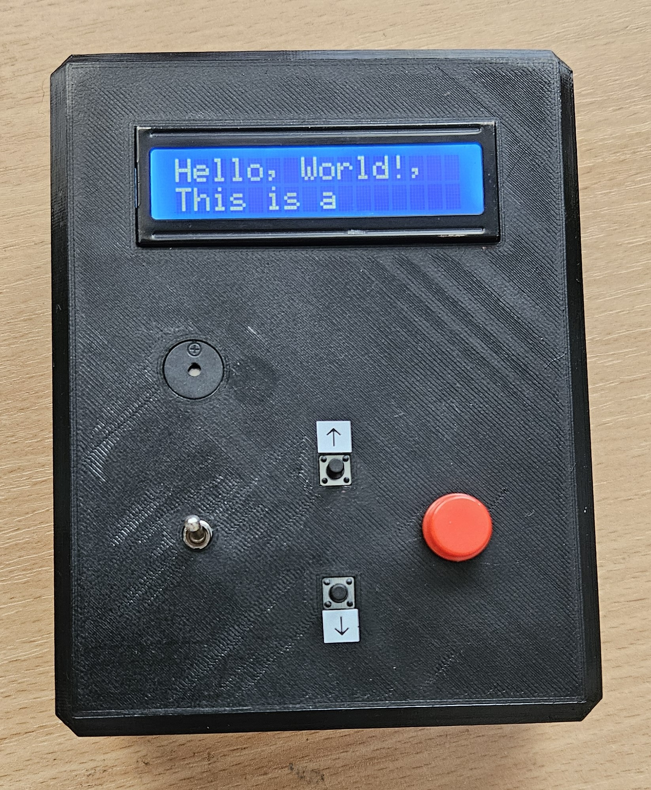
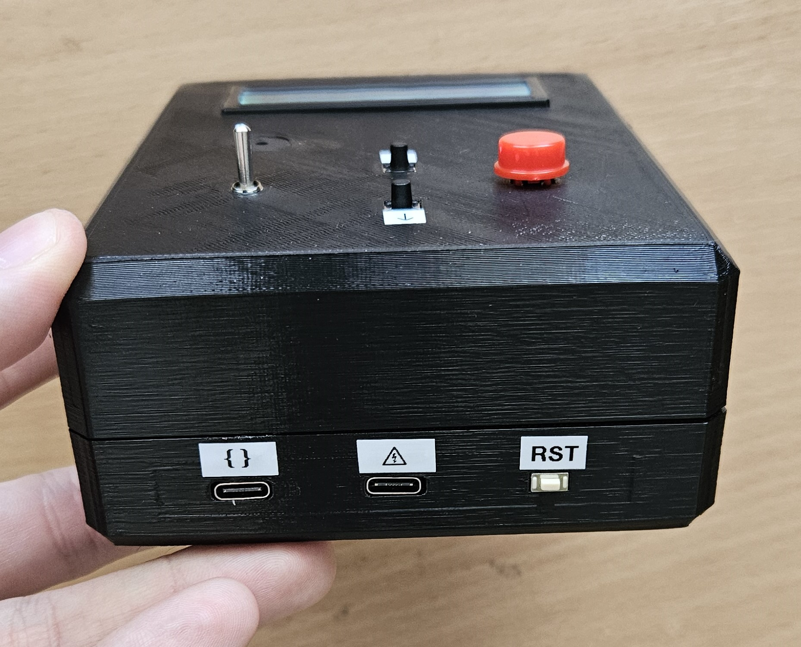
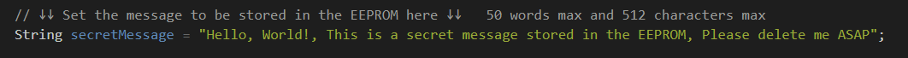
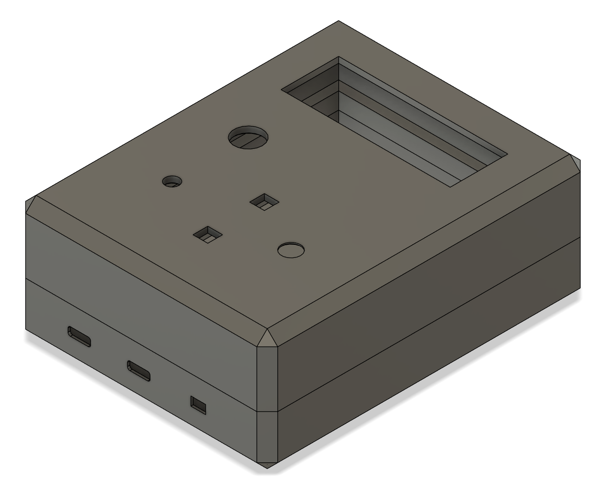
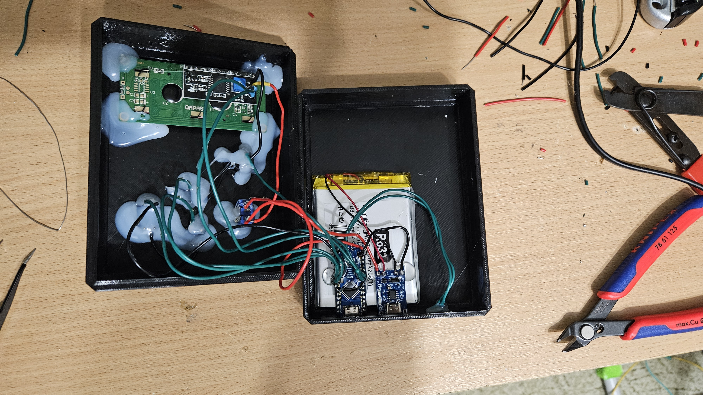
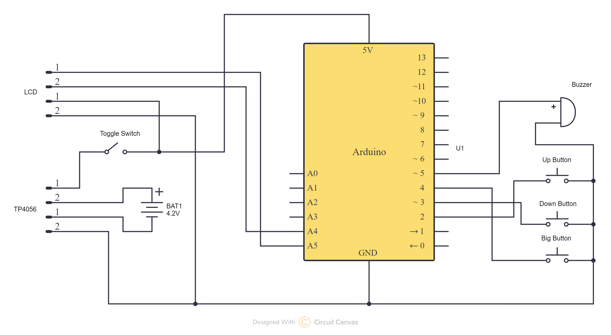

# Agent-Style-Secret-Message-Box

Inspired by the movie series "Mission Impossible", I want to create a way to send secret messages to someone in a secure way.

I got the idea to use the EEPROM of an arduino, since it can store data even when the power is cut nad it cant be recovered when overwritten.

## Usage
The device uses two pieces of code.

### Uploading a message
The user can write a secret message to the EEPROM by uploading the first program to the arduino.

### Reading a message
After uploading the message, the user uploads the second program to the arduino.
The second program reads the secret message from the EEPROM and displays it on the LCD.

The user can then scroll through the message using two buttons.
After reaching the end of the message, the user can confirm the message by pressing the BIG RED BUTTON.
If the user holds the button for 5 seconds, the message is deleted from the EEPROM.

## Parts
- Arduino Nano
- 16x2 LCD (I2C variant recommended)
- 2 small push buttons
- 1 bigger push button
- 1 buzzer
- 1 toggle switch
- 3D printed case
- Li-Ion/Li-Po battery with TP4056 charging module

## Circuit

The LCD is connected using the I2C protocol.
All buttons are connected to the ground and use the internal pull-up resistors of the arduino.
The buzzer is connected to digital pin and ground.
The toggle switch is connected to the positive output of the TP4056 module and all the arduino with LCD.
